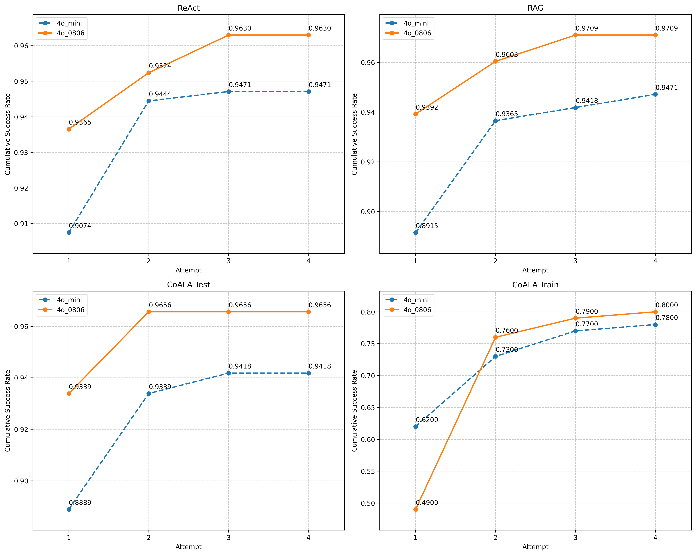

# Discussion: Other

## Failure mode: Limited creativity
One failure mode we observed which affects both models is the limited creativity 
of the model, as seen by it using the same solutions across iterations, 
even if different memories are retrieved.

On 4o mini, a non-memory example is in ReAct MBPP 237 where despite the feedback of the failed test case and the hint of a constraint in the assertion, 
the model could not spot the constraint and kept missing the point for the rest of the attempts. 
This problem will be covered in further detail in the [limitations](./limitations_memory.md) section.

Another example would be on 4o mini CoALA training APPS 561: 
Despite different memories retrieved and the negative execution feedback, 
it kept repeating repeating the same answer.

On 4o 0806, an example can be found in CoALA training on APPS 1030. 
The same repetition happened since the second attempt.

### Implications for Cognitive Architecture Design
These findings highlight a limitation in current LLM-based reasoning: 
the presence of diverse memory systems and execution feedback does not automatically confer the ability to synthesize novel solution approaches. 
This suggests that future work could look at reasoning strategies beyond LLMs, 
possibly a hybrid of LLM with symbolic or rule-based reasoning. 

---

## Do multiple attempts help?

The figure below shows the cumulative success rate of various strategies and models with respect to the attempt number. 
For the evaluation phase (MBPP Plus), 
the success rate refers to that of the public test case.

- In general, success rates improve with attempts but saturate by the 3rd iteration
- During CoALA training on APPS, there seems to be a significant boost going from the first to second attempt. This is largely attributable to the model not calling the function it wrote to print the answer to the console, leading to an error, but subsequently correcting itself after seeing the error message.
	- post 2nd iteration, the improvement is about 5%
- For MBPP Plus, the improvements range from about 3-5%

### Reconciling Limited Creativity with Improved Performance Across Attempts

The improvement in success rates across multiple attempts (as shown in the graph) alongside the observed limited creativity isn't necessarily contradictory. 

We hypothesize that the improvements across attempts likely come from **error correction** rather than true **creative reformulation**. 
The quick saturation by the 3rd iteration supports this hypothesis: 
Once simple fixes are exhausted, the model lacks the creative capacity to explore fundamentally different approaches, leading to diminishing returns.

In USACO Bench, the authors also found limited improvement beyond the 3rd iteration when evaluating on up to 6 iterations.

---

## Skill library
We adopted a Voyager-style skill library approach, 
where skills are defined as reusable functions that can be composed to solve new problems. 
One interesting result of the Voyager paper is the buildup of compositional skills -- 
Functions which call previously written functions. 
As such, it would be useful to investigate whether there was any skill library usage 
and if compositional skills were written in our experiments.

Unfortunately, for all training runs, there was only one function-based skill at best. 
This is because most of the random problems selected in the APPS training set required classes / 
code which prints to console rather than functions which return an output.

As such, with only one function-based skill, 
there was no usage of the skill library across all train and test runs, 
and there is no composition skill by default.
