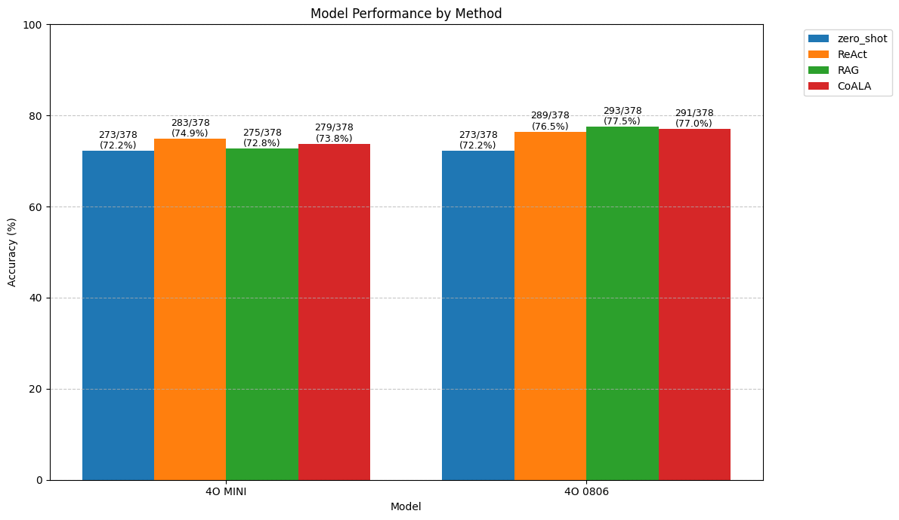

# Results

## Accuracy comparison

| Model | Zero shot | ReAct | RAG | CoALA |
|-------|-----------|--------|-----|--------|
| 4o mini | 72.2% | **74.9%** | 72.8% (k=3) | 73.8% (k=3, no episodic) |
| 4o 0806 | 72.2% | 76.5% | **77.5%** (k=1) | 77.0% (k=1) |

We see that the small model (4o mini) could not take advantage of additional knowledge, while the larger model (4o 0806) was able to leverage it more effectively.

## Error analysis counts

### GPT 4o mini

| Change Type | ReAct vs RAG | ReAct vs CoALA | RAG vs CoALA |
|------------|-------------|----------------|---------------|
| Pass → Fail | 18 | 17 | 12 |
| Fail → Pass | 10 | 13 | 16 |

### GPT 4o 0806

| Change Type | ReAct vs RAG | ReAct vs CoALA | RAG vs CoALA |
|------------|-------------|----------------|---------------|
| Pass → Fail | 6 | 8 | 9 |
| Fail → Pass | 10 | 10 | 7 |

We see that overall, the impact of Pass to Fail and Vice-versa Far outweighs the Change in Accuracy (total number of pass to fail and vice versa is significantly larger than the difference between the two)